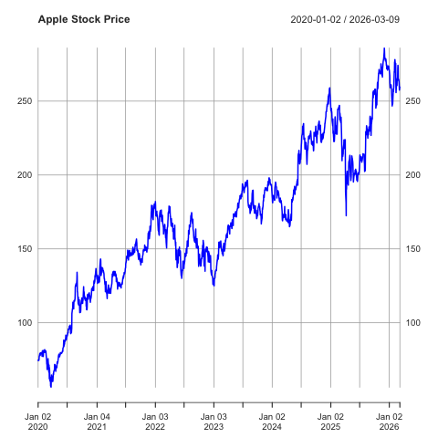
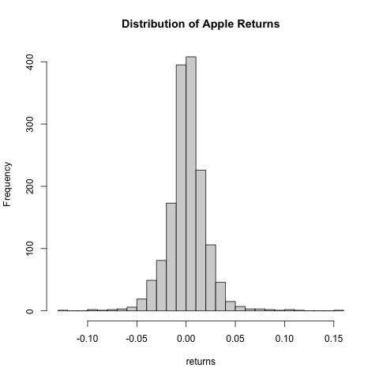
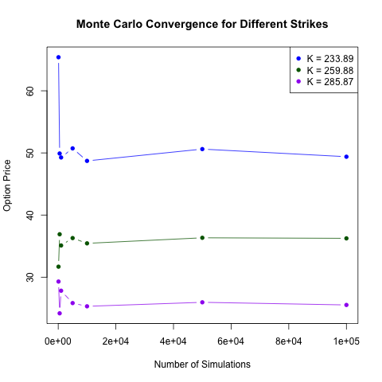

# Monte Carlo Option Pricing in R

## Overview

This project implements a Monte Carlo simulation to price European call options and compares the results to the analytical Black–Scholes formula.

The goal is to demonstrate how stochastic simulation can approximate option prices derived from financial theory.

---

## Financial Model

The stock price is modeled using Geometric Brownian Motion

$$
dS_t = \mu S_t dt + \sigma S_t dW_t
$$

where

- \($$S_t$$\) is the stock price
- \($$\sigma$$\) is volatility
- \($$W_t$$\) is Brownian motion

---

## Black–Scholes Price

The price of a European call option is

$$
C = S_0 N(d_1) - K e^{-rT} N(d_2)
$$

where

$$
d_1 = \frac{\ln(S_0/K)+(r+\sigma^2/2)T}{\sigma\sqrt{T}}
$$

$$
d_2 = d_1 - \sigma\sqrt{T}
$$

---

## Monte Carlo Estimation

The option price can also be estimated via simulation

$$
C = e^{-rT} E[\max(S_T-K,0)]
$$

This expectation is approximated by

$$
C_{MC} = e^{-rT} \frac{1}{N} \sum_{i=1}^N \max(S_T^{(i)}-K,0)
$$

## Data Exploration

To ground the model in real market behavior, historical stock data from **Apple Inc. (AAPL)** was analyzed using the R package `quantmod`.

### Stock Price Evolution

The following figure shows the historical closing price of Apple stock over time.

This time series provides the empirical data used to estimate the model parameters, particularly the volatility of returns.

---

### Distribution of Returns

Financial models such as the Black–Scholes framework assume that log-returns follow a normal distribution.

To investigate this assumption, the distribution of daily returns was computed and visualized.

While the distribution is roughly symmetric and centered around zero, financial return data often exhibit heavier tails than the normal distribution, which is a well-known limitation of the classical Black–Scholes model.

---

## Option Pricing Results

Using the estimated volatility and the current stock price, European call options were priced using two methods:

1. Analytical pricing via the **Black–Scholes formula**
2. Numerical approximation using **Monte Carlo simulation**

The results of both approaches are compared below.

---

### Option Price vs Strike Price

The following plot compares the option prices obtained via Monte Carlo simulation with the analytical Black–Scholes solution for several strike prices.

The close agreement between both curves confirms that the Monte Carlo simulation correctly reproduces the theoretical option prices.

---

### Monte Carlo Convergence

Monte Carlo pricing relies on the law of large numbers: as the number of simulations increases, the estimated price should converge toward the theoretical value.

The following plot illustrates this convergence behavior.

As expected, the Monte Carlo estimate approaches the analytical Black–Scholes price as the number of simulated paths increases, demonstrating the consistency of the numerical method.
